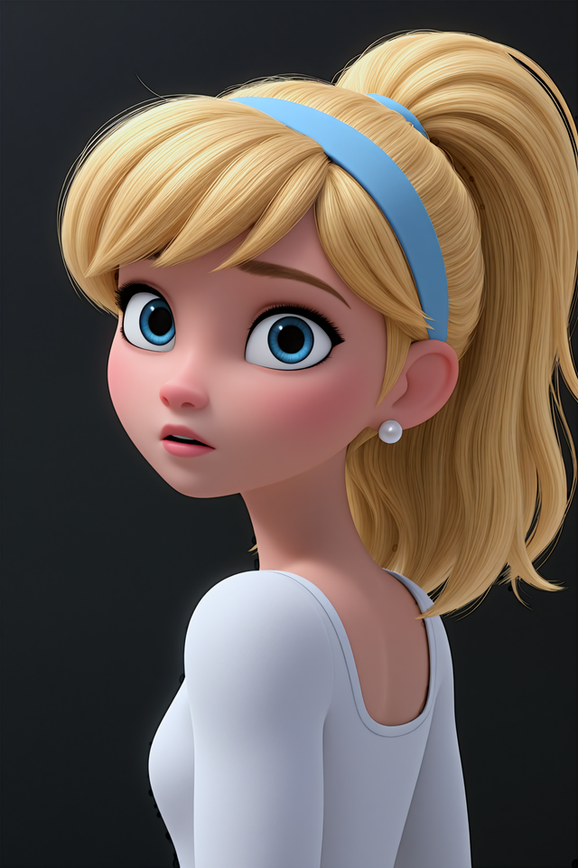
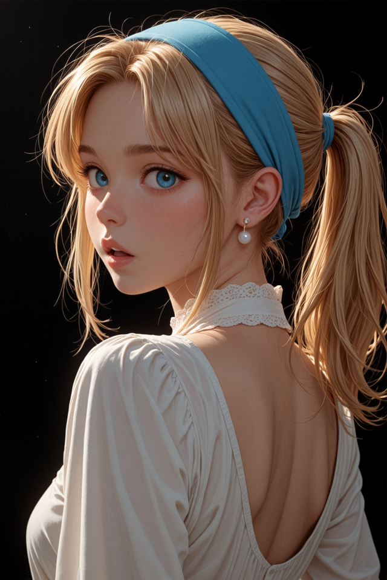
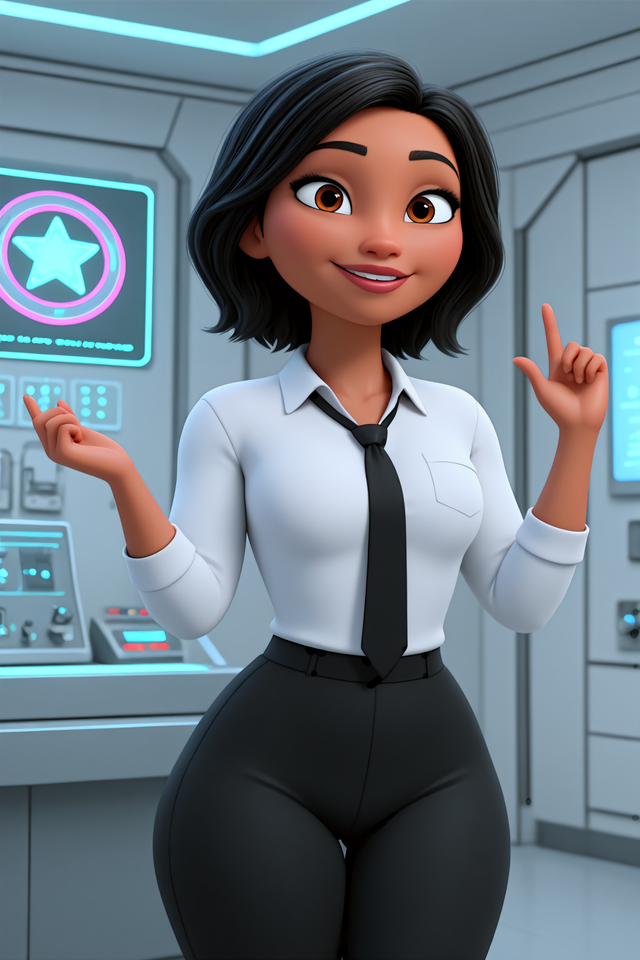
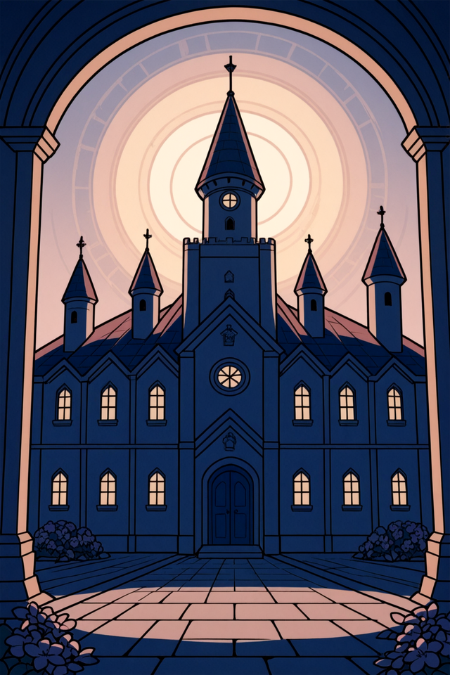
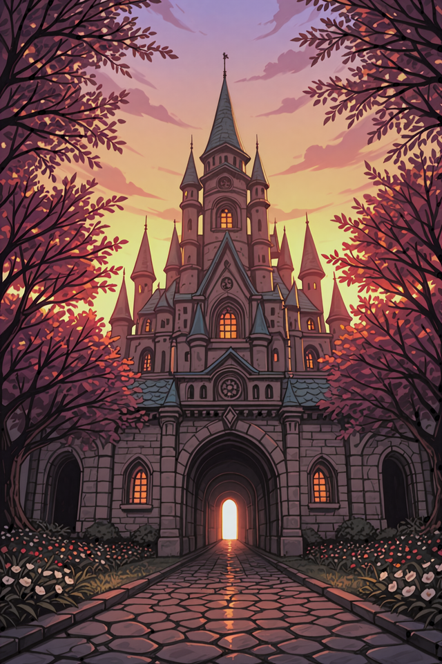
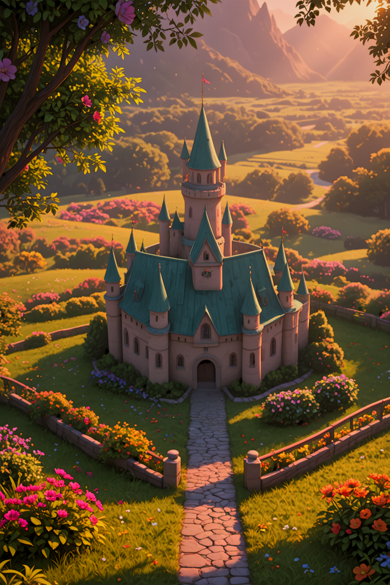
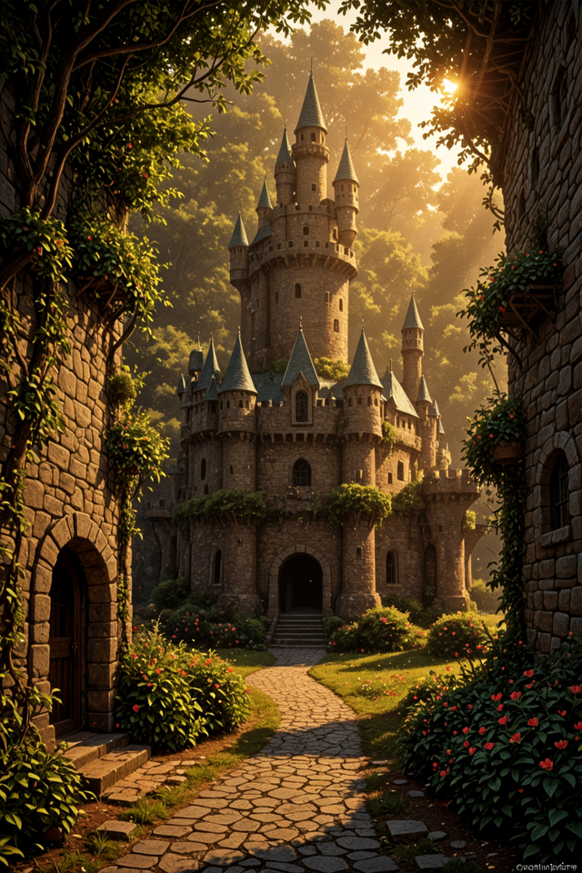

<div align="center">

# Neural-Pixel
[](https://deepwiki.com/Luiz-Alcantara/Neural-Pixel)
[](https://github.com/Luiz-Alcantara/Neural-Pixel/releases/latest)

**A simple GUI wrapper for stable-diffusion.cpp written using C and GTK 4.**

</div>

Neural Pixel is a fast, Vulkan-powered image generation tool that runs on almost any GPU from 2014+ (requires at least 2GB VRAM for SD 1.5 or 3GB for SDXL). Skip the CUDA/ROCm headache and Python dependency hell, Neural Pixel is simple, portable, and high-performing!

## Compatibility

- Neural Pixel supports leading image generation models such as SDXL and FLUX, plus a broad range of community models, extensions, and runtimes.
- By default, the release ZIP packages include support for Vulkan and CPU inference only.
- No video support at the moment.
- See [docs](./docs/compatibility.md) for the full list of supported models, features, formats, platforms, and backends.

## Linux Setup & Running

### 1. Requirements
- OS: Linux kernel >= 5.14 (Tested on RHEL 9, Fedora 42, and Arch).
- Dependencies: GTK >= 4.12, libpng, zlib.
- Vulkan backend (Optional): Vulkan driver/loader/tools & >= 2GB of VRAM.

### 2. How to Run
- Download the [](https://github.com/Luiz-Alcantara/Neural-Pixel/releases/download/v0.7.2/NeuralPixel-Linux_v0.7.2.zip)
- Extract the archive and execute the `run_neural_pixel` file.
- Tip: For debugging, launch from a terminal and enable Terminal Verbose under Extra Options.

## Windows Setup & Running
### 1. Requirements
- Microsoft Visual C++ Redistributable latest: [vc_redist](https://learn.microsoft.com/en-us/cpp/windows/latest-supported-vc-redist?view=msvc-170).
- A GPU or iGPU with at least 2GB of VRAM for Vulkan.

### 2. How to Run
- Download the [](https://github.com/Luiz-Alcantara/Neural-Pixel/releases/download/v0.7.2/NeuralPixel-Windows_v0.7.2.zip)
- Extract the archive and execute the `neural_pixel.bat` file.
- Note: You can run the `neural_pixel` binary directly, but the dark theme variable won't apply, which may cause rendering issues.

## Recommended checkpoints

- Due to hardware limitations, I used `q5_1` quantization and the DMD2 speed LoRA (0.7 weight) to generate these examples. The `Sam semi-realistic` model is the only exception, as it has the LoRA built-in. If you use the base model, your results may differ slightly.

> [!WARNING]
> The links to get the models may display NSFW, mature, or suggestive preview images. Viewer discretion is advised.

<table>
	<thead>
		<tr>
			<th><a href="https://civarchive.com/models/24149?modelVersionId=1540184" target="_blank" rel="noopener noreferrer">Mistoon NAI</a></th>
			<th><a href="https://civarchive.com/models/941345?modelVersionId=2182820" target="_blank" rel="noopener noreferrer">Hoseki V2</a></th>
			<th><a href="https://civarchive.com/models/1456548?modelVersionId=2598560" target="_blank" rel="noopener noreferrer">Dixar 4</a></th>
			<th><a href="https://civarchive.com/models/1876119?modelVersionId=2123506" target="_blank" rel="noopener noreferrer">Sam semi-realistic V1</a></th>
		</tr>
	</thead>
	<tbody>
		<tr>
			<td></td>
			<td></td>
			<td></td>
			<td></td>
		</tr>
		<tr>
			<td></td>
			<td></td>
			<td></td>
			<td></td>
		</tr>
		<tr>
			<td></td>
			<td></td>
			<td></td>
			<td></td>
		</tr>
	</tbody>
</table>

### Settings used
- Sampler: `Euler A` (more detail) or `LCM` (smoother/less detail)
- Scheduler: ays, exponential, or smoothstep
- Steps: 8-12

## Build

You'll need **GTK 4** and the **libpng development libraries** installed.
Then, clone this repository using:
```
git clone https://github.com/Luiz-Alcantara/Neural-Pixel.git
```
Next, navigate into the cloned directory and run:
```
mkdir build && cd build && cmake .. && make
```

To build on Windows Use MSYS2.

To build sd.cpp follow the instructions on its github page: [Stable-diffusion.cpp](https://github.com/leejet/stable-diffusion.cpp).

## Credits

- This project is a GUI for [stable-diffusion.cpp](https://github.com/leejet/stable-diffusion.cpp).

## Donations

- PayPal: [`Donate`](https://www.paypal.com/donate/?hosted_button_id=G29L2QHNWDJHJ)
- Bitcoin
```
bc1qhxxgy52s2ps9j2gyzfxtykccrrpkzpu9uvnhhe
```
- Litecoin
```
ltc1q8fu7j3zyckl0w4e6m2q85xc69ywvtpnjzdjhvq
```
